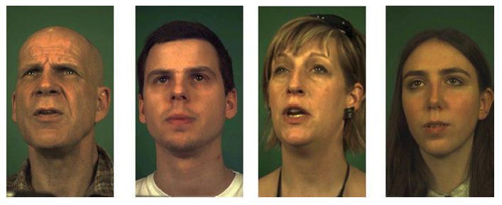
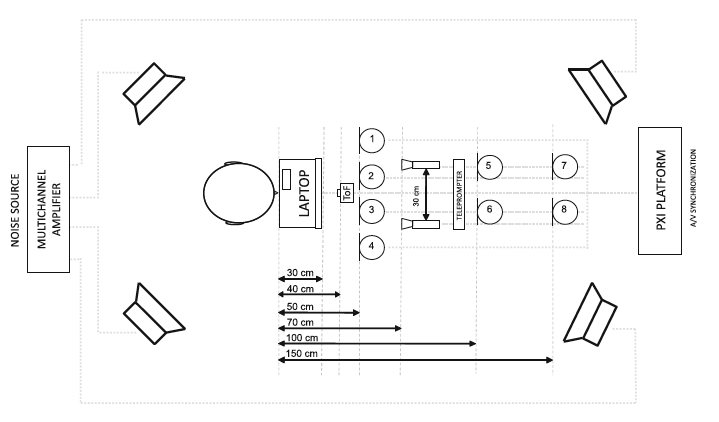

# Dataset download and setup

The dataset is a subset of the MODALITY dataset available [here](http://www.modality-corpus.org/). While the original
dataset contains 231 words separated in commands and sentences, we created a python script that extracted only the
commands videos and one of the 9 audios and later we clipped those files saving the parts were digits were spoken.

Extracting the single digits from longer commands allowed us to gather XXX instances of spoken digits by 35 different 
speakers. The final dataset has XXX GB.

## Video

The videos were originally set as 1920x1080 pixels (in portrait mode) and with 100 frames per second as `.mkv` files 
using `h264` encoder. After processing we ended up with 640x360 pixel videos (keeping the original ratio) and still 
100 fps. Below you will find an example of it:

## Audio

Although we did not use the audio on training our models, the dataset was prepared case further developments were needed.
The files were cropped consistently with the videos, and saved with the same name for later use in training.
Note that the dataset contains 9 different audio files collected from different microphones. 
We decided to go with one single audio file (audio from microphone 2).

  

## Hardware

To pre-process the dataset we instantiated a virtual server in IBM cloud, the main configurations used were:
* 4 CPUs
* 32 GB of RAM memory
* Boot disk of 25GB
* 2x Storage of 1.5TB

The high RAM memory was used to make sure the server was able to download and fit the whole zipfiles in memory, and 
extract only the needed ones. In this directory you will find a bash script to make sure the correct folder structure 
is correct and the dependencies are installed.

Note that we need to make sure the extra disks are mounted and set as an LVM partition, so we don't need  

### Dependencies:

* requests (pip)
* opencv (pip)
* pydub (pip)
* ffmpeg (Linux)
